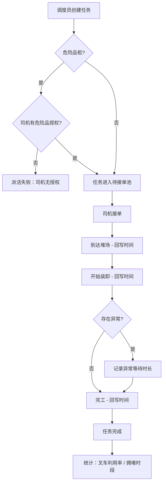

## 1. 产品概述

港口叉车司机派活系统，用于解决港口集装箱装卸作业中的任务调度、司机作业追踪及运营统计问题。目标用户为港口调度员、叉车司机和运营管理者。

- 主要目的：实现叉车任务智能分派、司机作业全流程时间追踪、危险品柜授权校验、运营数据可视化统计
- 产品价值：提升港口堆场作业效率，降低人工调度错误率，实现作业数据可追溯

## 2. 核心功能

### 2.1 用户角色

| 角色 | 注册方式 | 核心权限 |
|------|----------|----------|
| 调度员 | 管理员分配 | 创建派活任务、指派司机、查看任务状态、校验危险品权限 |
| 叉车司机 | 管理员分配 | 查看任务列表、接单、回写作业时间节点（到达/装卸开始/异常等待/完工） |
| 管理者 | 管理员分配 | 查看叉车利用率统计、拥堵时段分析、作业完成率报表 |

### 2.2 功能模块

1. **调度员工作台**：任务列表、新建派活表单、危险品柜自动校验、任务状态追踪
2. **司机作业端**：待接任务列表、进行中任务、时间节点回写、异常上报
3. **管理统计端**：叉车利用率仪表盘、时段拥堵热力图、任务完成率统计

### 2.3 页面详情

| 页面名称 | 模块名称 | 功能描述 |
|----------|----------|----------|
| 调度员工作台 | 任务看板 | 按状态分组展示所有任务（待指派/进行中/已完成/异常），支持筛选和搜索 |
| 调度员工作台 | 新建派活 | 录入船期、堆场位置、货柜编号、货柜重量、是否危险品、指派司机，提交时自动校验危险品授权 |
| 调度员工作台 | 任务详情 | 查看任务完整信息、时间节点记录、异常备注 |
| 司机作业端 | 任务列表 | 展示待接单和进行中的任务，支持一键接单 |
| 司机作业端 | 作业流程 | 依次记录到达堆场时间、装卸开始时间、异常等待时长、完工时间 |
| 管理统计端 | 利用率仪表盘 | 展示每台叉车的日/周利用率、空闲时长、作业次数 |
| 管理统计端 | 拥堵分析 | 按时段展示堆场拥堵热力图，识别高峰时段 |
| 管理统计端 | 作业报表 | 任务完成率、平均作业时长、异常率等统计指标 |

## 3. 核心流程

调度员根据船期和堆场需求创建派活任务，系统自动校验危险品柜与司机资质匹配度，校验通过后任务进入待接单池。司机查看并接单，随后依次回写到达堆场、开始装卸、异常等待（如有）和完工时间。管理者通过统计看板查看叉车利用率和拥堵时段数据。

## 4. 用户界面设计

### 4.1 设计风格

- 主色调：深海蓝 `#0A2540`（港口工业感），辅助色：警示橙 `#FF6B35`（危险品/异常）、成功绿 `#10B981`（正常状态）
- 按钮风格：圆角 6px，微立体阴影，悬停上浮
- 字体：系统默认无衬线字体，标题加粗 16-18px，正文 14px
- 布局风格：顶部导航 + 左侧功能菜单，卡片式内容区块
- 图标风格：Lucide 线性图标

### 4.2 页面设计概览

| 页面名称 | 模块名称 | UI 元素 |
|----------|----------|---------|
| 调度员工作台 | 任务看板 | 深色顶部导航、四列状态看板、可拖拽任务卡片、状态色彩标签 |
| 调度员工作台 | 新建派活 | 抽屉式表单、级联选择（堆场位置）、危险品警示标识、司机资质校验提示 |
| 司机作业端 | 任务列表 | 移动端友好卡片、大按钮接单、任务优先级色条 |
| 司机作业端 | 作业流程 | 步骤条进度展示、时间戳自动记录、异常弹窗录入 |
| 管理统计端 | 利用率仪表盘 | 柱状图 + 数字卡片、日期范围选择器、颜色渐变条 |
| 管理统计端 | 拥堵分析 | 热力图网格、时段坐标轴、颜色深浅表示拥堵程度 |

### 4.3 响应式

- Desktop 优先设计，调度员和管理端使用宽屏布局
- 司机作业端适配平板和手机，按钮和输入区域优化触控
