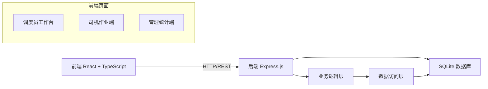
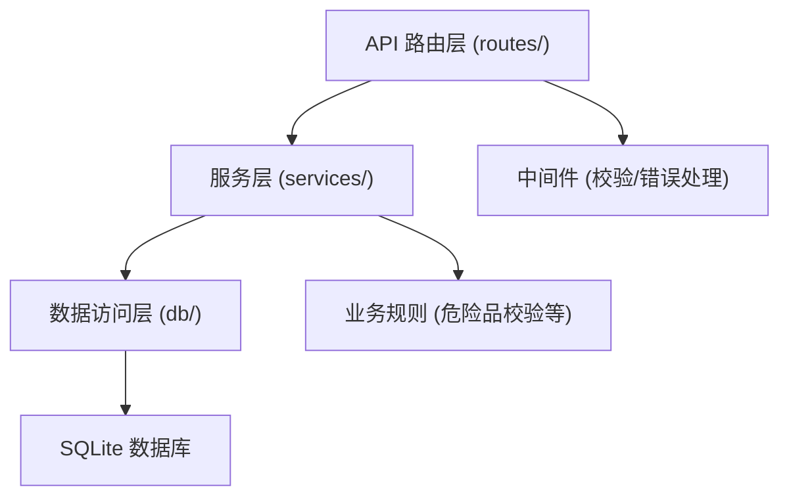
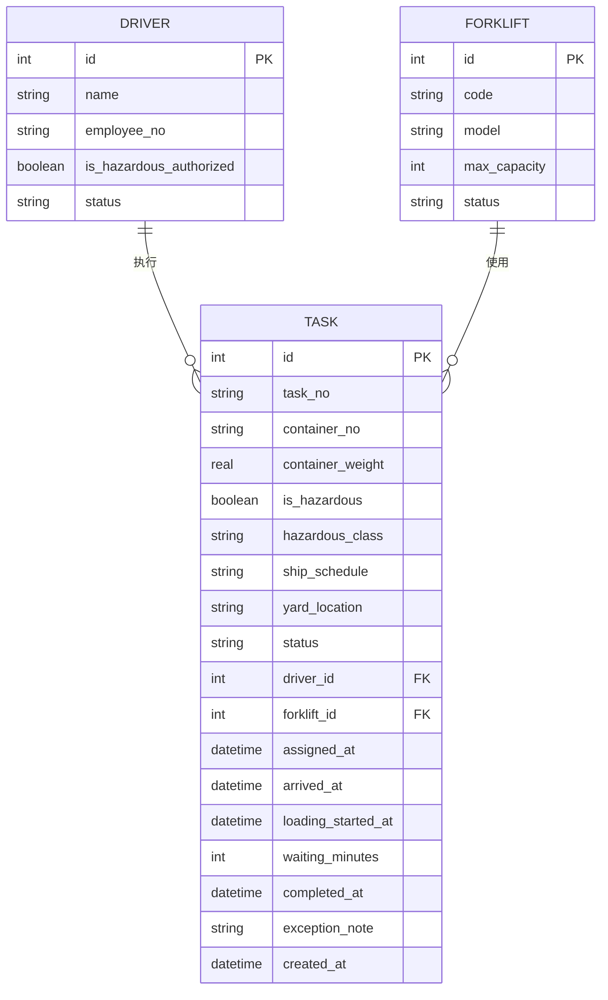

## 1. 架构设计



## 2. 技术描述

- 前端：React@18 + TypeScript + Vite + TailwindCSS@3 + React Router + Zustand + Lucide React + Recharts
- 初始化工具：vite-init
- 后端：Express@4 + TypeScript（ESM）
- 数据库：SQLite（better-sqlite3），内置初始数据
- 状态管理：Zustand 管理全局状态（当前用户、任务筛选条件）

## 3. 路由定义

| 路由 | 用途 |
|------|------|
| / | 角色选择入口 |
| /dispatcher | 调度员工作台 - 任务看板 |
| /dispatcher/task/new | 调度员 - 新建派活 |
| /dispatcher/task/:id | 调度员 - 任务详情 |
| /driver | 司机端 - 任务列表 |
| /driver/task/:id | 司机端 - 作业流程 |
| /admin | 管理端 - 统计仪表盘 |
| /admin/congestion | 管理端 - 拥堵分析 |

## 4. API 定义

```typescript
// 司机
interface Driver {
  id: number;
  name: string;
  employeeNo: string;
  isHazardousAuthorized: boolean;
  status: 'idle' | 'working' | 'offline';
}

// 叉车
interface Forklift {
  id: number;
  code: string;
  model: string;
  maxCapacity: number; // 吨
  status: 'available' | 'in_use' | 'maintenance';
}

// 货柜任务
interface Task {
  id: number;
  taskNo: string;
  containerNo: string;
  containerWeight: number;
  isHazardous: boolean;
  hazardousClass?: string;
  shipSchedule: string;
  yardLocation: string;
  status: 'pending' | 'assigned' | 'arrived' | 'loading' | 'waiting' | 'completed' | 'exception';
  driverId?: number;
  forkliftId?: number;
  assignedAt?: string;
  arrivedAt?: string;
  loadingStartedAt?: string;
  waitingMinutes?: number;
  completedAt?: string;
  exceptionNote?: string;
  createdAt: string;
}

// 利用率统计
interface Utilization {
  forkliftId: number;
  forkliftCode: string;
  date: string;
  workingMinutes: number;
  idleMinutes: number;
  utilizationRate: number;
}

// API Endpoints
// GET    /api/drivers                  - 获取司机列表
// GET    /api/drivers/:id              - 获取司机详情
// GET    /api/forklifts                - 获取叉车列表
// GET    /api/tasks                    - 获取任务列表（支持 status 筛选）
// GET    /api/tasks/:id                - 获取任务详情
// POST   /api/tasks                    - 创建派活任务
// PATCH  /api/tasks/:id/assign         - 指派司机/叉车
// PATCH  /api/tasks/:id/accept         - 司机接单
// PATCH  /api/tasks/:id/arrive         - 回写到达时间
// PATCH  /api/tasks/:id/start-loading  - 回写装卸开始时间
// PATCH  /api/tasks/:id/waiting        - 记录异常等待
// PATCH  /api/tasks/:id/complete       - 回写完工时间
// GET    /api/stats/utilization        - 叉车利用率统计
// GET    /api/stats/congestion         - 拥堵时段统计
```

## 5. 服务端架构图



## 6. 数据模型

### 6.1 ER 图



### 6.2 DDL

```sql
CREATE TABLE driver (
    id INTEGER PRIMARY KEY AUTOINCREMENT,
    name TEXT NOT NULL,
    employee_no TEXT UNIQUE NOT NULL,
    is_hazardous_authorized INTEGER NOT NULL DEFAULT 0,
    status TEXT NOT NULL DEFAULT 'idle' CHECK(status IN ('idle','working','offline'))
);

CREATE TABLE forklift (
    id INTEGER PRIMARY KEY AUTOINCREMENT,
    code TEXT UNIQUE NOT NULL,
    model TEXT NOT NULL,
    max_capacity INTEGER NOT NULL,
    status TEXT NOT NULL DEFAULT 'available' CHECK(status IN ('available','in_use','maintenance'))
);

CREATE TABLE task (
    id INTEGER PRIMARY KEY AUTOINCREMENT,
    task_no TEXT UNIQUE NOT NULL,
    container_no TEXT NOT NULL,
    container_weight REAL NOT NULL,
    is_hazardous INTEGER NOT NULL DEFAULT 0,
    hazardous_class TEXT,
    ship_schedule TEXT NOT NULL,
    yard_location TEXT NOT NULL,
    status TEXT NOT NULL DEFAULT 'pending' CHECK(status IN ('pending','assigned','arrived','loading','waiting','completed','exception')),
    driver_id INTEGER REFERENCES driver(id),
    forklift_id INTEGER REFERENCES forklift(id),
    assigned_at TEXT,
    arrived_at TEXT,
    loading_started_at TEXT,
    waiting_minutes INTEGER DEFAULT 0,
    completed_at TEXT,
    exception_note TEXT,
    created_at TEXT NOT NULL DEFAULT CURRENT_TIMESTAMP
);

CREATE INDEX idx_task_status ON task(status);
CREATE INDEX idx_task_driver ON task(driver_id);
CREATE INDEX idx_task_created ON task(created_at);

-- 初始数据
INSERT INTO driver (name, employee_no, is_hazardous_authorized, status) VALUES
('张伟', 'D001', 1, 'idle'),
('李强', 'D002', 0, 'idle'),
('王磊', 'D003', 1, 'working'),
('刘洋', 'D004', 0, 'idle'),
('陈军', 'D005', 1, 'idle');

INSERT INTO forklift (code, model, max_capacity, status) VALUES
('FL-001', 'HELI 5T', 5, 'available'),
('FL-002', 'HELI 10T', 10, 'in_use'),
('FL-003', 'LINDE 8T', 8, 'available'),
('FL-004', 'HELI 5T', 5, 'available'),
('FL-005', 'TOYOTA 15T', 15, 'maintenance');

INSERT INTO task (task_no, container_no, container_weight, is_hazardous, ship_schedule, yard_location, status) VALUES
('TK20260612001', 'MSKU1234567', 8.5, 0, 'COSCO-001 / 06-14 08:00', 'A区-03-12', 'pending'),
('TK20260612002', 'MSC9876543', 12.0, 1, '3类易燃液体', 'MAERSK-023 / 06-13 14:00', 'B区-01-05', 'assigned'),
('TK20260612003', 'CMAU4567890', 5.2, 0, 'EVERGREEN-108 / 06-15 10:00', 'A区-05-08', 'completed');
```
